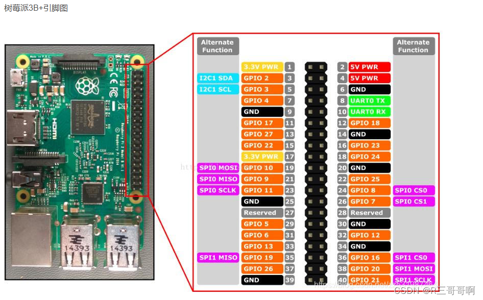
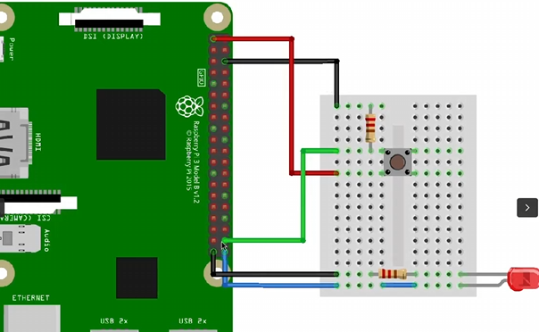

### 实现模块进行gpio控制
树莓派3B+的引脚编号图如下：

接线如下：

LED灯正极接GPIO21输出模式引脚，负极接地。
按钮一段连接GPIO20输入模式引脚，同时下拉电阻接地，另一端连接3.3V电源，当按下按钮3.3V通过下拉电阻连通GPIO20，实现输入高电平

#### 实现LED模块
`static struct gpio_desc *led, *button;`
对GPIO的控制主要通过gpio描述符来实现，
而配置GPIO设置需要知道GPIO引脚编号：引脚编号 + 芯片偏差
        首先查询设备中的GPIO芯片：
        ```c
        ：gpiodetect
        gpiochip0 [pinctrl-bcm2835] (54 lines)  // GPIO主控
        gpiochip1 [raspberrypi-exp-gpio] (8 lines)  // 扩展引脚
        gpiochip0 [pinctrl-bcm2835] (54 lines)
        ```
        在/sys/class/gpio/会显示GPIO设备的偏差编号
        ```c
        ls /sys/class/gpio/
        export  gpiochip512  gpiochip566  unexport
        ```
        怎么知道哪个对应gpiochip0呢？
        `cat gpiochip512/label
        pinctrl-bcm2835
        `
        知道chip0对应偏差521；
想要驱动引脚，首先要获得引脚的描述符`led = gpio_to_desc(IO_LED + IO_OFFSET);`
`state = gpiod_direction_output(led, 0);`将 GPIO 设置为输出模式并控制初始电平
之后获取状态位：`state = gpiod_direction_output(led, 0);`
`gpiod_set_value(led, 1);`通过此函数控制；

通过此配置可以做到加载模块给LED输出高电平，卸载模块输出低电平
#### 实现BUTTON模块
不同于LED,button常用于控制对GPIO的输入，配置GPIO描述符操作与LED相同，
但是需要将GPIO设置为输入模式`state = gpiod_direction_input(button);`
之后可通过此函数：`gpiod_get_value(char *gpio_desc_name)`查询电位值